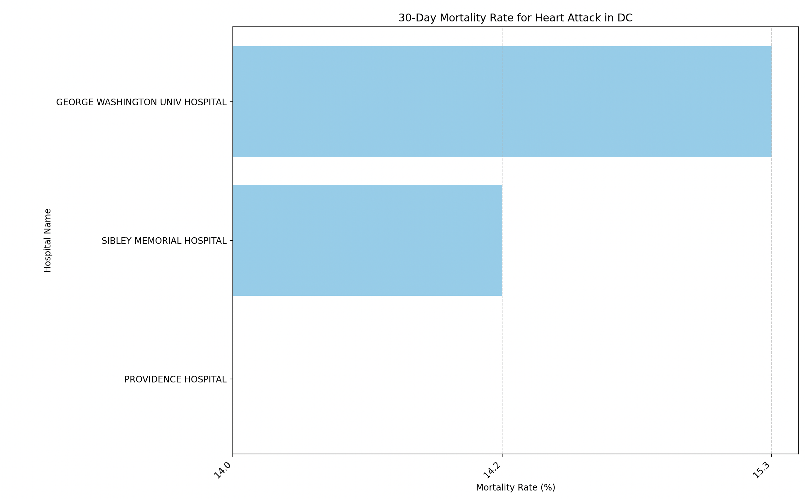

# Hospital Outcome Project

This project provides a Python function to analyze hospital mortality rates and identify the best hospitals in a given
state based on 30-day mortality rates for specific diseases.

## Features

- Extracts and analyzes hospital mortality rates from a dataset.

- Filters hospitals by state and disease type.

- Ranks hospitals based on their mortality rate (lower is better).

- Visualizes the top hospitals using a horizontal bar chart.

- Displays the best hospital(s) with the lowest mortality rate.

## Installation

This project requires Python and the following dependencies:

``pip install pandas matplotlib``

## Usage

Load the hospital data from a CSV file.

Call the ``best_hospitals`` function with the desired parameters.

## Data visualisation

# Contact

Wei Jan Chang, weijan.chang@gmail.com